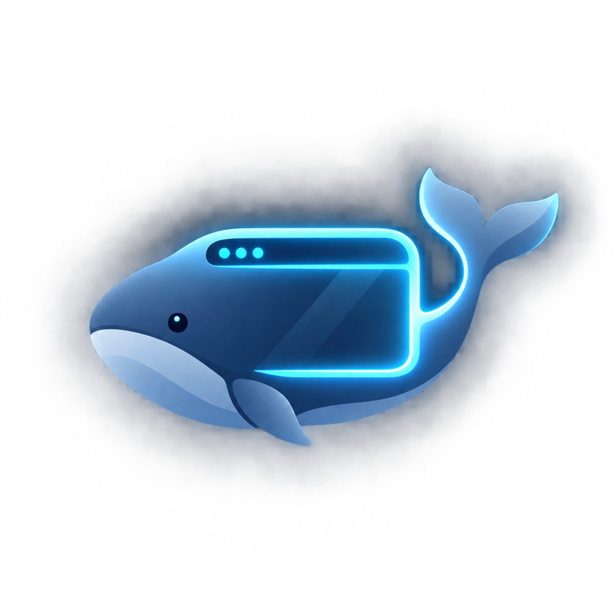
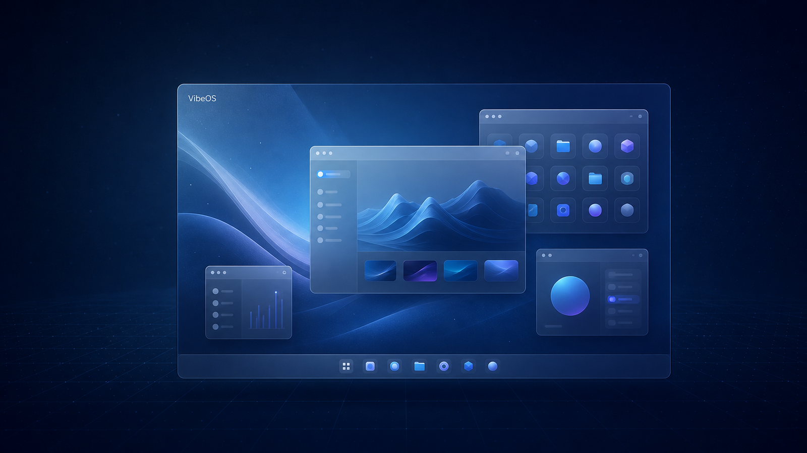
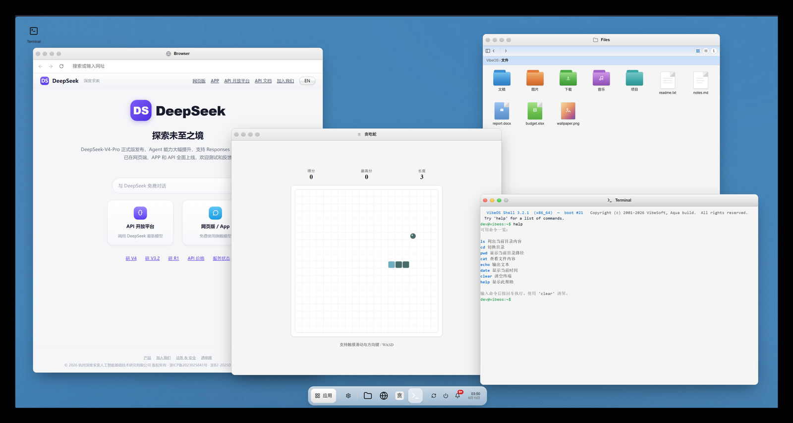
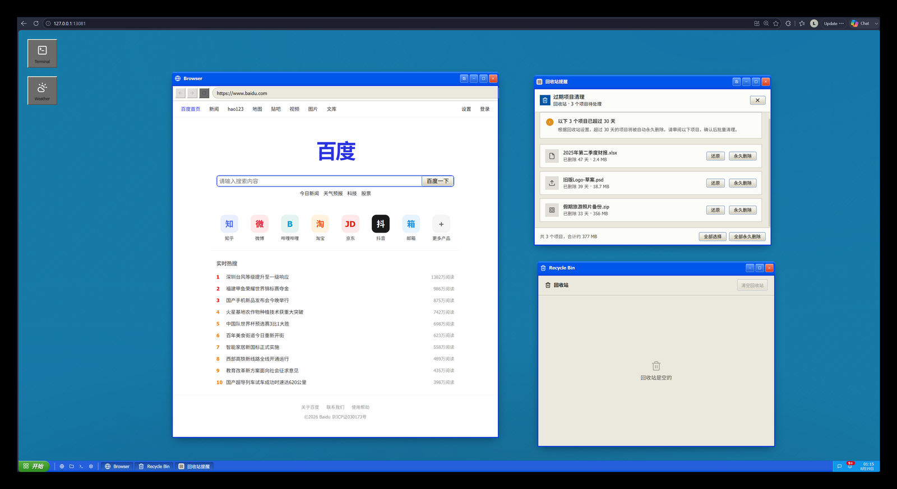
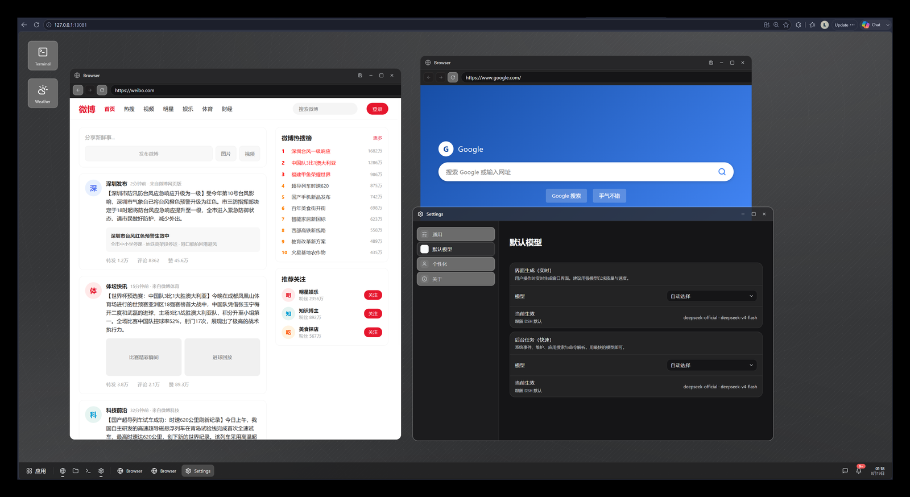
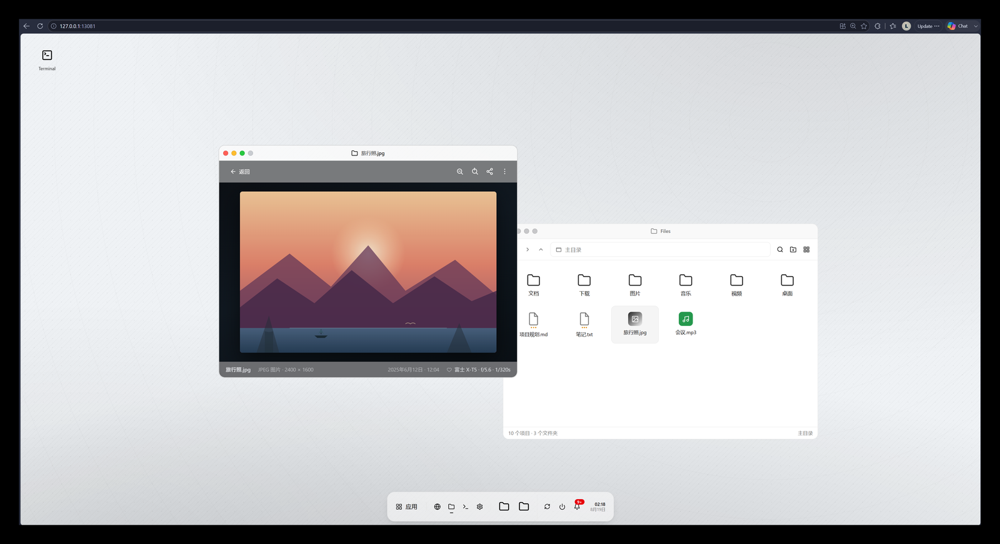

<div align="center">



# VibeOS

**English** · [简体中文](./README.md)

**The whale operating system for DeepSeek Harness? (make-believe)**

</div>



Desktop, windows, notifications, files — the shell is real; every frame inside a window is written
by the model as you use it. You click, the system answers. A file manager, a terminal, a browser,
any app you can name: open it and it exists.

## What it looks like

| | |
|---|---|
|  |  |
|  |  |

## Install

Linux / macOS:

```sh
mkdir -p ~/dsh-plugins && cd ~/dsh-plugins      # wherever you keep plugins
git clone https://github.com/Loping151/dsh-vibeos.git && cd dsh-vibeos
dsh plugin --profile web add file:.
```

Windows (PowerShell):

```powershell
mkdir -Force ~\dsh-plugins; cd ~\dsh-plugins
git clone https://github.com/Loping151/dsh-vibeos.git; cd dsh-vibeos
dsh plugin --profile web add file:.
```

Restart dsh web and hard-refresh the browser. Nothing to build; to update, `git pull` then remove
and add again.

## Daily use

- **Shut down (classic mode)**: switch back to stock DSH anytime — start menu, tray power button, or
  Settings; the floating VibeOS button returns to the desktop. While shut down, no background model
  calls are made.
- **Uninstall**: `dsh plugin --profile web remove dsh-vibeos`
- **Undo / redo**: `Ctrl+Z` / `Ctrl+Shift+Z` steps the focused window back and forward one frame.
- **Restart**: like a fresh session — the current one is archived automatically (last 3 kept) and
  restorable from Settings → General; your settings always survive.

## Configuration

No config files. Two synced surfaces, effective immediately:

- The **Settings** app on the desktop — models, skins, language, background pacing, generation
  style, wallpaper.
- In classic mode, the **VibeOS** section of the DSH settings dialog — the same settings.

Models follow the DSH default and prefer the flash tier; override per role (UI / background).

## Extending

- [Custom skins](docs/skins.md) — a skin is one block of CSS.
- [Client API](docs/client-api.md) — override fifteen components (clock, taskbar, …), register
  native apps, skins and menus.

## Data

Everything lives in `~/.dsh/storages/vibeos_*.json` and `vibeos-images/`; no sessions are created,
nothing touches your chat history. Delete the files for a factory reset.

## Credits

Ported from [VibeOS](https://github.com/benis-me/VibeOS) (MIT) — the desktop kernel and interaction
contract are its design, thank you. Original inspiration: the Microsoft Build 2026 "Vibe OS" demo
([video](https://www.youtube.com/watch?v=zh6fMtL_cSM)). Not affiliated with Microsoft.

[MIT](./LICENSE)
